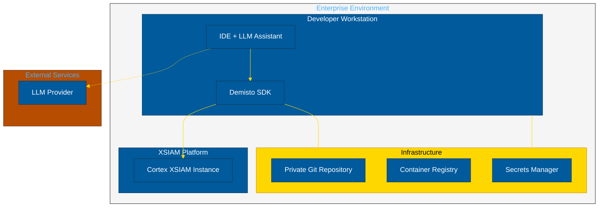
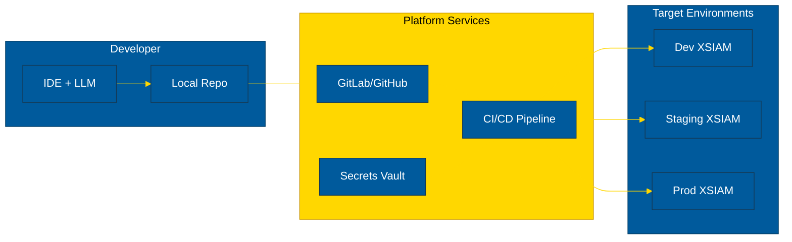

# Enterprise Packaging Options

Strategies for deploying XSIAM LLM development toolkit in private enterprise environments.

## Architecture Overview



---

## Option 1: Git Template Repository

**Best for**: Teams wanting minimal infrastructure overhead.

### Structure

```
xsiam-dev-template/
├── .cursorrules                    # Cursor rules
├── .clinerules                     # Cline rules
├── .amazonq/
│   └── rules/
│       └── xsiam.md               # Amazon Q rules
├── CLAUDE.md                       # Claude context
├── Agents.md                       # Agent definitions
├── .pre-commit-config.yaml         # Validation hooks
├── scripts/
│   └── xsiam_dev_helper.py        # SDK wrapper
├── docs/
│   └── xsiam-kb/                  # Knowledge base
│       ├── schemas/
│       ├── patterns/
│       └── examples/
└── Packs/
    └── .gitkeep                   # Placeholder for content
```

### Deployment

```bash
# Create new project from template
git clone https://github.com/your-org/xsiam-dev-template.git my-xsiam-content
cd my-xsiam-content

# Configure environment
cp .env.example .env
# Edit .env with your XSIAM credentials

# Install dependencies
pip install demisto-sdk
pre-commit install

# Start developing
demisto-sdk init --pack -n "MyPack"
```

### Advantages
- Simple setup
- No infrastructure required
- Easy to update via git pull

### Limitations
- Requires manual SDK installation
- No centralised LLM configuration

---

## Option 2: Docker Development Environment

**Best for**: Consistent environments across teams.

### Dockerfile

```dockerfile
FROM python:3.11-slim

# Install system dependencies
RUN apt-get update && apt-get install -y \
    git \
    curl \
    && rm -rf /var/lib/apt/lists/*

# Install demisto-sdk
RUN pip install --no-cache-dir demisto-sdk

# Install pre-commit
RUN pip install --no-cache-dir pre-commit

# Create workspace
WORKDIR /workspace

# Copy configuration files
COPY .cursorrules .clinerules CLAUDE.md Agents.md ./
COPY .pre-commit-config.yaml ./
COPY scripts/ ./scripts/
COPY docs/ ./docs/

# Set up entrypoint
COPY docker-entrypoint.sh /usr/local/bin/
RUN chmod +x /usr/local/bin/docker-entrypoint.sh

ENTRYPOINT ["docker-entrypoint.sh"]
CMD ["bash"]
```

### docker-compose.yml

```yaml
version: '3.8'

services:
  xsiam-dev:
    build: .
    volumes:
      - ./Packs:/workspace/Packs
      - ~/.gitconfig:/root/.gitconfig:ro
    environment:
      - DEMISTO_BASE_URL=${DEMISTO_BASE_URL}
      - DEMISTO_API_KEY=${DEMISTO_API_KEY}
    stdin_open: true
    tty: true
```

### Usage

```bash
# Build and start
docker-compose up -d

# Enter development environment
docker-compose exec xsiam-dev bash

# Run SDK commands
demisto-sdk validate -i Packs/MyPack
```

### VS Code Dev Container

Create `.devcontainer/devcontainer.json`:

```json
{
  "name": "XSIAM Development",
  "dockerComposeFile": "../docker-compose.yml",
  "service": "xsiam-dev",
  "workspaceFolder": "/workspace",
  "customizations": {
    "vscode": {
      "extensions": [
        "ms-python.python",
        "redhat.vscode-yaml",
        "saoudrizwan.claude-dev"
      ],
      "settings": {
        "python.defaultInterpreterPath": "/usr/local/bin/python"
      }
    }
  },
  "remoteEnv": {
    "DEMISTO_BASE_URL": "${localEnv:DEMISTO_BASE_URL}",
    "DEMISTO_API_KEY": "${localEnv:DEMISTO_API_KEY}"
  }
}
```

### Advantages
- Consistent environment
- Pre-configured tools
- Works with VS Code Dev Containers

### Limitations
- Requires Docker
- LLM assistants run on host

---

## Option 3: Enterprise Python Package

**Best for**: Organisations with internal PyPI repositories.

### Package Structure

```
xsiam-dev-toolkit/
├── pyproject.toml
├── src/
│   └── xsiam_dev_toolkit/
│       ├── __init__.py
│       ├── cli.py
│       ├── helper.py
│       └── templates/
│           ├── cursorrules.txt
│           ├── clinerules.txt
│           ├── claude_md.txt
│           └── agents_md.txt
└── README.md
```

### pyproject.toml

```toml
[build-system]
requires = ["hatchling"]
build-backend = "hatchling.build"

[project]
name = "xsiam-dev-toolkit"
version = "1.0.0"
description = "XSIAM content development toolkit with LLM assistant support"
dependencies = [
    "demisto-sdk>=1.38.0",
    "pre-commit>=3.0.0",
]

[project.scripts]
xsiam-init = "xsiam_dev_toolkit.cli:init_project"
xsiam-dev = "xsiam_dev_toolkit.cli:main"
```

### CLI Implementation

```python
# src/xsiam_dev_toolkit/cli.py
import click
from pathlib import Path
import importlib.resources as resources

@click.group()
def main():
    """XSIAM Development Toolkit"""
    pass

@main.command()
@click.argument('project_name')
@click.option('--output', '-o', default='.', help='Output directory')
def init_project(project_name: str, output: str):
    """Initialise a new XSIAM development project."""
    project_path = Path(output) / project_name
    project_path.mkdir(parents=True, exist_ok=True)
    
    # Copy template files
    templates = ['cursorrules', 'clinerules', 'claude_md', 'agents_md']
    file_mapping = {
        'cursorrules': '.cursorrules',
        'clinerules': '.clinerules',
        'claude_md': 'CLAUDE.md',
        'agents_md': 'Agents.md'
    }
    
    for template in templates:
        content = resources.read_text('xsiam_dev_toolkit.templates', f'{template}.txt')
        dest = project_path / file_mapping[template]
        dest.write_text(content)
    
    # Create directory structure
    (project_path / 'Packs').mkdir(exist_ok=True)
    (project_path / 'docs' / 'xsiam-kb').mkdir(parents=True, exist_ok=True)
    
    click.echo(f"Created XSIAM project: {project_path}")

if __name__ == '__main__':
    main()
```

### Installation

```bash
# From internal PyPI
pip install xsiam-dev-toolkit --index-url https://pypi.internal.company.com/simple/

# Initialise project
xsiam-init my-xsiam-content
cd my-xsiam-content
```

### Advantages
- Easy distribution via PyPI
- Version controlled
- Includes CLI tools

### Limitations
- Requires internal PyPI
- More complex to maintain

---

## Option 4: Platform Engineering (GitOps)

**Best for**: Large organisations with platform teams.

### Architecture



### GitLab CI Pipeline

```yaml
# .gitlab-ci.yml
stages:
  - validate
  - test
  - deploy

variables:
  DEMISTO_SDK_VERSION: "1.38.15"

.sdk_setup: &sdk_setup
  before_script:
    - pip install demisto-sdk==${DEMISTO_SDK_VERSION}
    - export DEMISTO_BASE_URL="${CI_ENVIRONMENT_URL}"
    - export DEMISTO_API_KEY="${XSIAM_API_KEY}"

validate:
  stage: validate
  <<: *sdk_setup
  script:
    - demisto-sdk format -i Packs/ -y
    - demisto-sdk validate -i Packs/
  rules:
    - if: $CI_PIPELINE_SOURCE == "merge_request_event"

test:
  stage: test
  <<: *sdk_setup
  script:
    - demisto-sdk lint -i Packs/
  rules:
    - if: $CI_PIPELINE_SOURCE == "merge_request_event"

deploy:dev:
  stage: deploy
  <<: *sdk_setup
  environment:
    name: development
    url: https://dev.xsiam.company.com
  script:
    - demisto-sdk upload -i Packs/
  rules:
    - if: $CI_COMMIT_BRANCH == "develop"

deploy:prod:
  stage: deploy
  <<: *sdk_setup
  environment:
    name: production
    url: https://xsiam.company.com
  script:
    - demisto-sdk upload -i Packs/
  rules:
    - if: $CI_COMMIT_BRANCH == "main"
  when: manual
```

### Advantages
- Full automation
- Environment promotion
- Audit trail
- Secrets management

### Limitations
- Requires platform team
- More complex setup

---

## LLM Provider Options for Enterprise

### Self-Hosted / Private

| Provider | Deployment | Use Case |
|----------|------------|----------|
| **AWS Bedrock** | AWS VPC | Claude, Llama in private network |
| **Azure OpenAI** | Azure VNet | GPT-4 in private network |
| **Ollama** | On-premises | Local models, air-gapped |
| **vLLM** | On-premises | Self-hosted open models |

### Managed with Enterprise Controls

| Provider | Features |
|----------|----------|
| **Anthropic Enterprise** | SOC 2, data retention controls |
| **OpenAI Enterprise** | Data not used for training |
| **Amazon Q Developer** | AWS IAM integration |

### Configuration Example (AWS Bedrock)

```json
{
  "cline.provider": "bedrock",
  "cline.awsRegion": "ap-southeast-2",
  "cline.model": "anthropic.claude-sonnet-4-20250514-v1:0",
  "cline.awsProfile": "enterprise-dev"
}
```

---

## Security Considerations

### Secrets Management

```bash
# Use environment variables (not in code)
export DEMISTO_API_KEY=$(vault kv get -field=api_key secret/xsiam/dev)

# Or use AWS Secrets Manager
export DEMISTO_API_KEY=$(aws secretsmanager get-secret-value \
  --secret-id xsiam/api-key --query SecretString --output text)
```

### Network Controls

- Use VPC endpoints for AWS services
- Configure proxy for external LLM providers
- Implement egress filtering

### Data Classification

- Mark playbooks containing sensitive logic
- Use .gitignore for local test data
- Implement pre-commit secrets scanning

---

## Recommendation Matrix

| Scenario | Recommended Option |
|----------|-------------------|
| Small team, quick start | Option 1: Git Template |
| Consistent environments | Option 2: Docker |
| Enterprise distribution | Option 3: Python Package |
| Large org, full automation | Option 4: GitOps |

