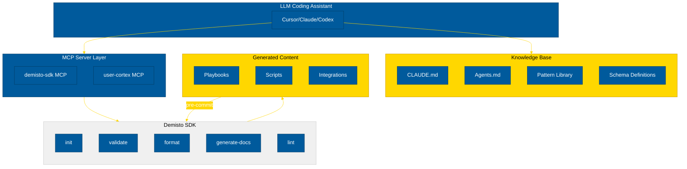
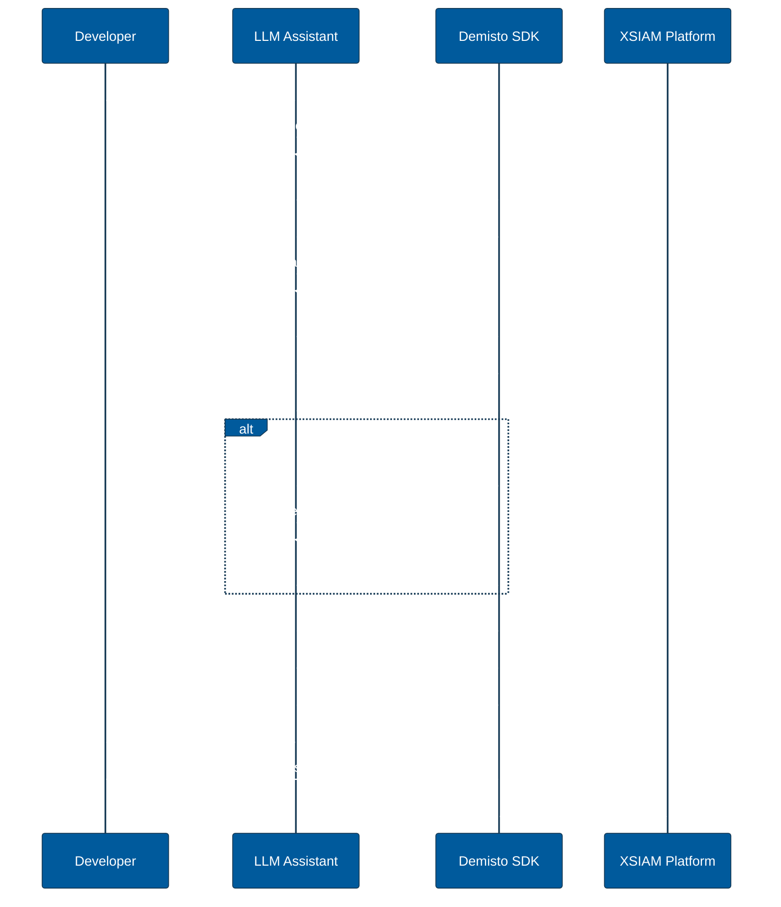
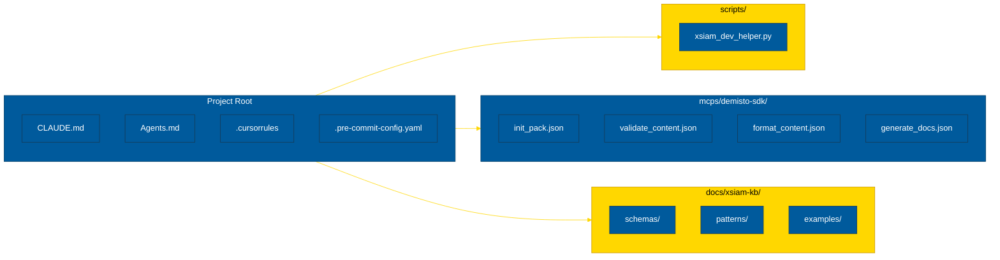
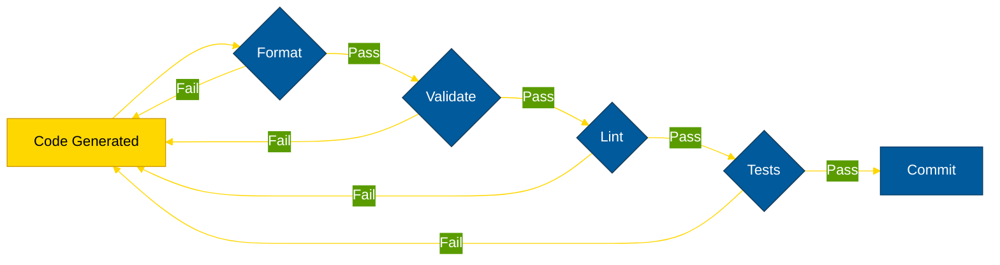

# XSIAM LLM-Assisted Development Plan

## Overview

Integration of Demisto SDK with LLM coding assistants (Cursor, Claude Code CLI, Codex) for automated playbook and script development.

## Architecture

## Development Workflow

## Component Structure

## Implementation Tasks

| Task | Description | Output |
|------|-------------|--------|
| MCP Extension | SDK command wrappers | `mcps/demisto-sdk/tools/*.json` |
| CLAUDE.md | Primary LLM context | `CLAUDE.md` |
| Agents.md | Agent-specific guidance | `Agents.md` |
| Helper Script | SDK automation wrapper | `scripts/xsiam_dev_helper.py` |
| Pre-commit | Validation hooks | `.pre-commit-config.yaml` |

## SDK Command Reference

| Command | Purpose | When Used |
|---------|---------|-----------|
| `init --pack` | Create pack structure | New pack |
| `init --integration` | Scaffold integration | New integration |
| `init --script` | Scaffold script | New script |
| `format` | Standardise formatting | After generation |
| `validate` | Check validity | Before commit |
| `generate-docs` | Create README | After validation |
| `lint` | Code quality | CI/CD |
| `upload` | Deploy to platform | Testing |

## Quality Gates

